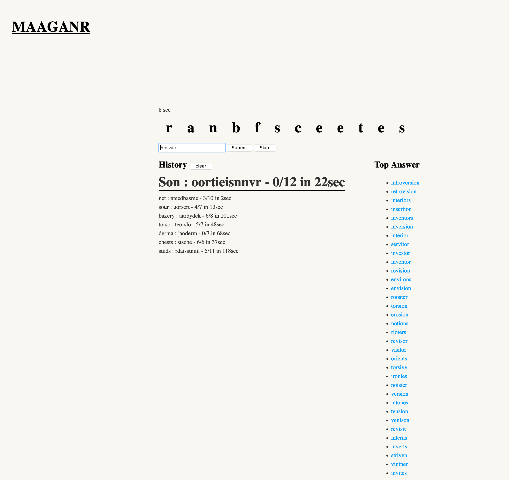

# Features

* Shuffle dictionary word into anagram
* Timer
* List of possible answers
* Link to wiktionary
* History

# Usage

```
lein run -m anagram.server
```

## Development mode

```
lein figwheel
```

### Optional development tools

Start the browser REPL:

```
$ lein repl
```
The Jetty server can be started by running:

```clojure
(start-server)
```
and stopped by running:
```clojure
(stop-server)
```

## Building for release

```
lein do clean, uberjar
```
